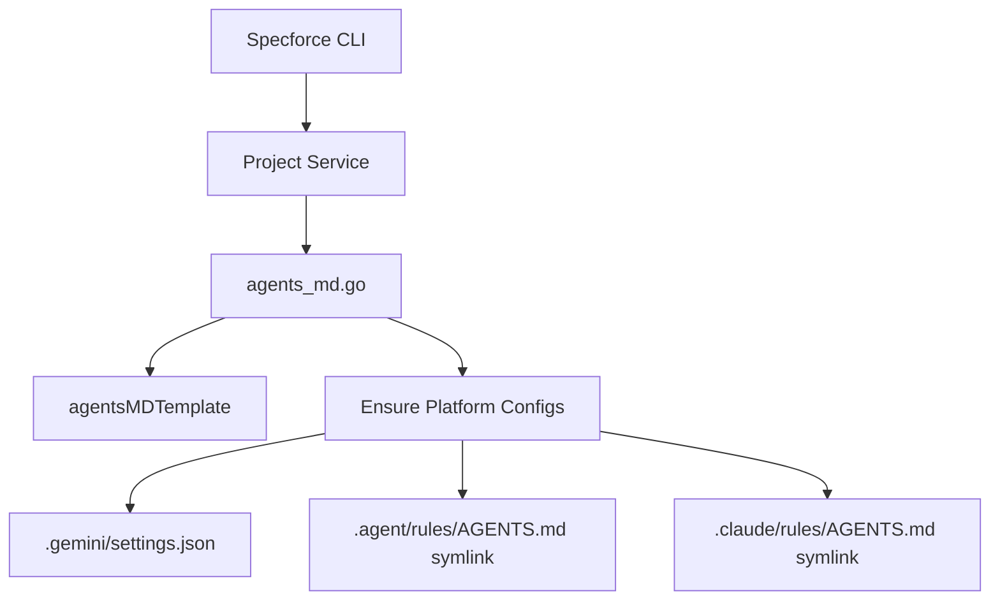

# Technical Design: AGENTS.md Hooks and Platform Configuration

## 1. Architecture Blueprint

## 2. API & Interfaces (The Contract)

### Internal Template Update
The `agentsMDTemplate` constant in `src/internal/project/agents_md.go` will be updated to include the correct hook names.

### New Functionality
`EnsureAgentsMD` will be extended to call a new private function `ensurePlatformConfigs(root string) error`.

**`ensurePlatformConfigs` Responsibilities:**
- **Gemini:** Ensure `.gemini/` directory exists. Write `settings.json` with `fileName` as an array: `["AGENTS.md", "GEMINI.md"]`.
- **Antigravity:** Ensure `.agent/rules/` directory exists. Create relative symlink `AGENTS.md -> ../../AGENTS.md`.
- **Claude Code:** Ensure `.claude/rules/` directory exists. Create relative symlink `AGENTS.md -> ../../AGENTS.md`.

## 3. File & Component Inventory

**Backend:**
- `src/internal/project/agents_md.go` -> Update template and implement `ensurePlatformConfigs`.
- `src/internal/project/agents_md_test.go` -> Add tests for platform config creation.
