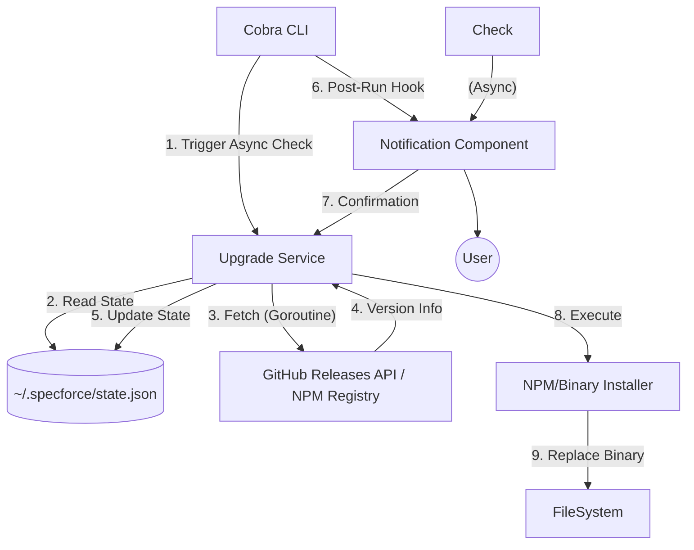

# Technical Design: Auto-Update Capability

## 1. Architecture Blueprint
The auto-update system follows a decoupled service-provider pattern. A background goroutine handles the non-blocking version check, while the TUI layer manages the interactive upgrade flow.



## 2. Persistence & Data Modeling
- **Location:** `~/.specforce/state.json` (Expanded via `core.ExpandPath`)
- **Structure:**
```json
{
"last_check_at": "2023-10-27T10:00:00Z",
"latest_version": "v1.2.3",
"ignored_version": "v1.2.2"
}
```

## 3. API & Interfaces (The Contract)

### Internal Service Contract
```go
package upgrade

type Service interface {
// CheckForUpdate initiates an async background check.
// Respects the 24h throttle and command annotations.
CheckForUpdate(ctx context.Context, cmdName string)

// IsUpdateAvailable returns the result of the last check.
IsUpdateAvailable() (bool, string)

// PerformUpgrade executes the update strategy (NPM vs Binary).
PerformUpgrade(ctx context.Context, version string) error
}
```

### External API Contracts
- **GitHub Release Discovery:**
  - **Endpoint:** `GET https://api.github.com/repos/jeancodogno/specforce-kit/releases/latest`
  - **Expected Response (200 OK):** 
    ```json
    { "tag_name": "v0.2.0", "assets": [...] }
    ```
- **NPM Registry Discovery:**
  - **Endpoint:** `GET https://registry.npmjs.org/@jeancodogno/specforce-kit/latest`
  - **Expected Response (200 OK):** 
    ```json
    { "version": "0.2.0" }
    ```
## 4. File & Component Inventory

**Backend:**
- `src/internal/upgrade/service.go` -> Main service implementing throttling, background orchestration, and version comparison.
- `src/internal/upgrade/state.go` -> Persistence handler for global `~/.specforce/` state.
- `src/internal/upgrade/provider.go` -> Strategy implementations for `GitHubProvider` and `NPMProvider`.
- `src/internal/upgrade/installer.go` -> Atomic binary replacement logic with checksum verification.
- `src/internal/cli/cobra/root.go` -> `PersistentPreRun` hook for background check and `PersistentPostRun` for notification injection.

**Frontend:**
- `src/internal/tui/upgrade.go` -> Lipgloss-styled "New Version" box component and Bubbletea "Upgrade Now?" prompt.

## 5. Security & Resilience (Threat Modeling)
- **Binary Integrity:** All standalone binary updates MUST download and verify an accompanying `.sha256` checksum before replacing the active binary.
- **Path Escape Prevention:** Replacement of the active binary must use `os.Executable()` to find the target and `core.SecurePath` to validate destination write permissions.
- **Race Condition Protection:** State updates to `state.json` MUST use a file lock or atomic write (`WriteFile` to temp + `Rename`) to prevent corruption if multiple CLI instances run simultaneously.
- **Silence on Network Failure:** All background network calls MUST be wrapped in a timeout-bound context (max 2s) and return `nil` on error to ensure zero impact on primary command performance.
- **LLM-Mode Isolation:** The `CheckForUpdate` call MUST be skipped if `IsTTY()` is false or if the command is marked with a `IsAgentCommand: true` annotation.

## 6. Surface Blueprint (UI/UX)
- **Layout:** Notification appears as a 1-line borderless box at the very end of the terminal output.
- **Colors:** Text in `Secondary Cyan (#00FFFF)`, Version in `Mint Green (#00FA9A)`.
- **Interaction:** Confirming an upgrade switches the TUI to a "Progress" view (Mint Green progress bar) and then exits with instructions to restart the CLI.
