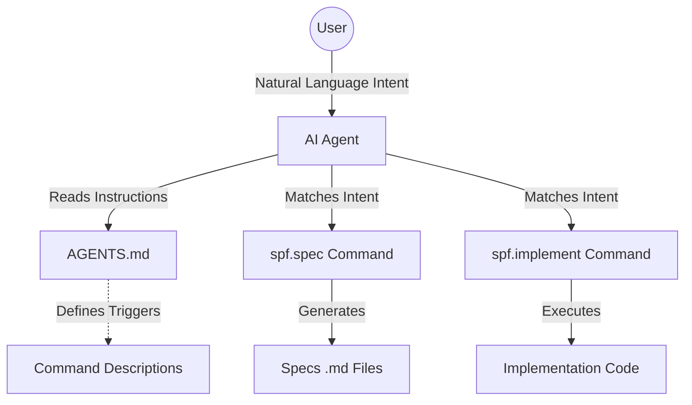

# Technical Design: Autonomous SDD Workflow via Skills

## 1. Architecture Blueprint
*This diagram illustrates how the LLM agent bridges user intent with the existing Specforce commands via the updated AGENTS.md instructions.*



## 4. File & Component Inventory

**Configuration & Documentation:**
- `[AGENTS.md]` -> Update the autonomous workflow protocol section to explicitly instruct the agent to use the `spf.spec` and `spf.implement` commands as its primary workflow engines based on intent.
- `[src/internal/agent/kit/commands/spec.yaml]` -> Update the `description` field to make it an "intent magnet" for the LLM (e.g., "SDD Orchestrator. Activate when planning...").
- `[src/internal/agent/kit/commands/implement.yaml]` -> Update the `description` field to clearly define when to trigger the implementation cycle (e.g., "TDD Implementation Engine. Activate when tasks are ready...").

**Backend:**
- `[src/internal/agent/kit/kit.yaml]` -> Modify the mapping rules for agents so that the `commands` directory files are also processed and outputted into the `skills` directory during `specforce init`. To support dual installation, the mapping structure must be updated to accept an array of destinations. For example:
  ```yaml
  gemini-cli:
    target: ".gemini/"
    mappings:
      commands:
        - path: "commands/spf"
          ext: ".toml"
        - path: "skills" # Dual installation as a skill
          ext: ".md"
  ```
- `[src/internal/agent/translator.go]` (if necessary) -> Update the translation logic to parse the `commands` mapping as an array and execute the translation/writing loop for each destination block provided in `kit.yaml`.
