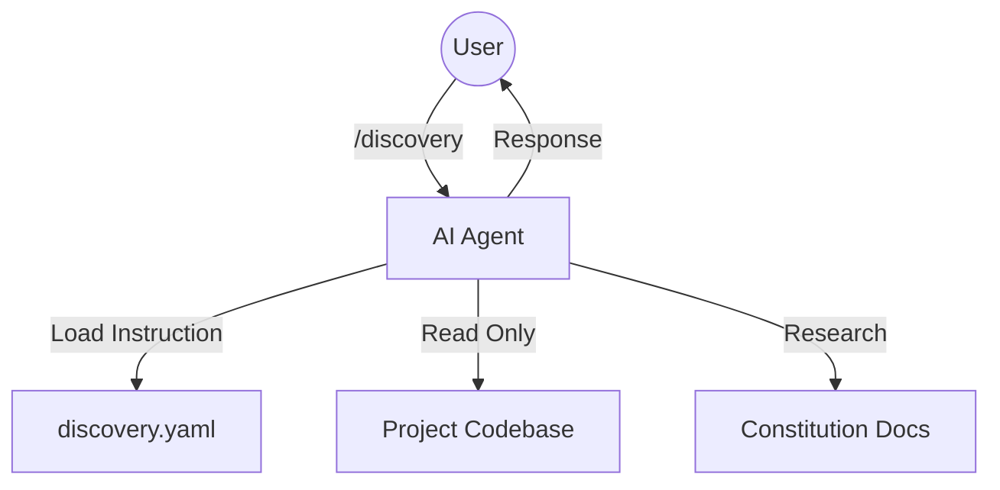

# Technical Design: Discovery Command

## 1. Architecture Blueprint

This feature is an extension of the Specforce Kit, introducing a new agent command instruction. It does not require changes to the Go source code but relies on the kit translation system to propagate the new prompt to all supported AI agent configurations.

## 2. Persistence & Data Modeling
*(Omitted - No database changes)*

## 3. API & Interfaces (The Contract)

### Agent Command: `spf.discovery`
- **Mapping:**
  - Gemini/Claude: `spf.discovery` (via `.toml`/`.md` command files).
  - OpenCode/KiloCode: `spf.discovery.md` (via `commands/`).
  - Kimi Code: `skills/spf-discovery/SKILL.md`.
- **Instruction Contract:**
  - Must define two primary personas: "Senior Product Architect" (Brainstormer) and "Senior Systems Engineer" (Detective).
  - Must explicitly forbid `replace`, `write_file`, or `run_shell_command` that mutates state (e.g., `git commit`, `npm install`).
  - Must enforce reading `.specforce/docs/*.md` for context.

## 4. File & Component Inventory

**Kit Resources:**
- `src/internal/agent/kit/commands/discovery.yaml` -> Contains the primary YAML definition, mapping, and Markdown prompt for the discovery command.

**Verification Artifacts:**
- `src/internal/agent/translator_test.go` -> (Existing) Should be used to verify that the new command is correctly translated for all targets.
