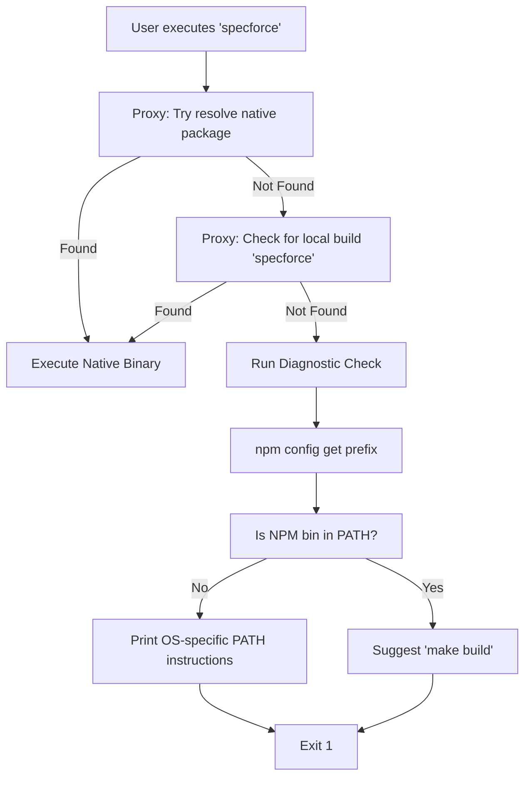

# Technical Design: Fix Command Not Found

## 1. Architecture Blueprint

The SpecForce Kit utilizes a Node.js proxy (`index.js`) to bridge the gap between the NPM installation and the native Go binary. The following flow ensures that if the binary is missing, the user receives precise, actionable feedback.

### Diagnostic Decision Matrix
| Condition | Detected Via | Actionable Advice |
|---|---|---|
| NPM Bin not in PATH | `process.env.PATH` vs `npm prefix` | Provide `export` (Unix) or `setx` (Windows) command |
| Binary not built (Dev) | `fs.existsSync` in root | Suggest `make build` |
| Binary missing (Install) | `require.resolve` failure | Suggest reinstalling with `--force` or checking internet connection |

## 2. Persistence & Data Modeling
*No database or persistent schema changes are required for this feature.*

## 3. API & Interfaces (The Contract)

### The Proxy Interface
The `index.js` proxy MUST maintain full transparency:
- **Input:** Forwards all `process.argv.slice(2)` to the native binary.
- **Output:** Inherits `stdio: 'inherit'` to preserve TUI/CLI formatting.
- **Lifecycle:** Propagates the exit code from the native process to the shell.

### The Diagnostic UX Contract
When a failure occurs, the output MUST follow the "Ghost in the Machine" aesthetic:
- **Primary Header:** Bold Mint Green (`#00FA9A`) or Error Red (`#FF5F5F`) bracketed title.
- **OS Specifics:**
    - **Unix:** Suggest `export PATH="$PATH:/path/to/npm/bin"` and adding to `~/.zshrc`.
    - **Windows:** Suggest `setx PATH "%PATH%;C:\path\to\npm\bin"` or the Environment Variables UI path.

## 4. File & Component Inventory

### Implementation
- **`index.js`**:
    - Add `getNPMBinPath()` helper using `spawnSync('npm', ['config', 'get', 'prefix'])`.
    - Add `isPathCorrect(expectedPath)` verification logic.
    - Enhance the fallback error handler with OS-specific instructions (using `process.platform`).
    - Integrate minimal ANSI styling for diagnostic headers.

- **`package.json`**:
    - Update/Verify `prepare` script: `"prepare": "make build || true"`.
    - Add `postinstall` script: `"postinstall": "make build || true"` to ensure binary exists after `npm install`.

### Documentation
- **`README.md`**:
    - Add a "Troubleshooting" section covering the "Command Not Found" error.
- **`docs/getting-started.md`**:
    - Add a detailed "Installation Troubleshooting" guide with OS-specific manual PATH configuration steps and common pitfalls.

## 5. Observability & Resilience
- **Race Conditions:** The `postinstall` and `prepare` scripts use `|| true` to prevent installation failures if `go` or `make` are missing (e.g., in a locked-down CI or container without build tools).
- **Graceful Degradation:** If `npm` itself is not found during the diagnostic check, the proxy should fall back to a generic "check your installation" message rather than crashing.
