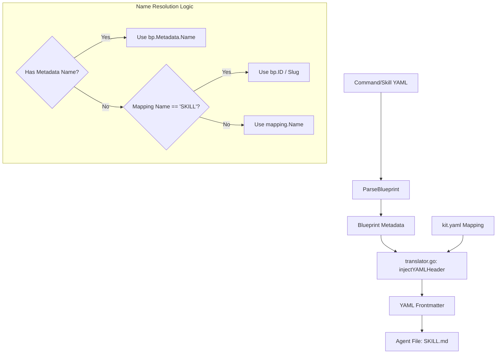

# Technical Design: Unique Command Names in Skill Headers

## 1. Architecture Blueprint

The data flow ensures that during the translation of framework assets (Commands/Skills) to agent-native files, the YAML header's `name` property is derived from the most specific identity available.



## 2. File & Component Inventory

**Backend:**
- `src/internal/agent/translator.go` -> Update `injectYAMLHeader` to handle the `"SKILL"` fallback. If `mapping.Name` is `"SKILL"` and metadata name is empty, use `bp.ID` (prefixed with `spf.` for commands).
- `src/internal/agent/kit/commands/archive.yaml` -> Add `name: spf.archive` to root metadata.
- `src/internal/agent/kit/commands/constitution.yaml` -> Add `name: spf.constitution` to root metadata.
- `src/internal/agent/kit/commands/implement.yaml` -> Add `name: spf.implement` to root metadata.
- `src/internal/agent/kit/commands/spec.yaml` -> Add `name: spf.spec` to root metadata.

## 3. Implementation Details

### Logic Update in `translator.go`
```go
func injectYAMLHeader(bp *core.Blueprint, mapping core.MappingConfig, sourcePath string, category string) string {
    // ...
}
```

### Uniqueness Validation
The `Registry` or `Translator` MUST maintain an in-memory map of generated names during a single execution (e.g., during `refresh` or `install`). If a duplicate `name` is detected for different target paths, the process MUST abort with a descriptive error.


### Metadata Updates
Adding `name` to the root of command YAMLs ensures they are self-describing and independent of the mapping configuration.
