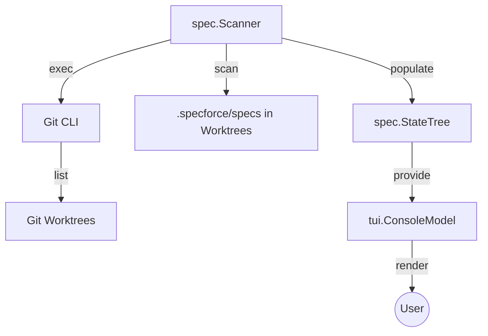

# Technical Design: Git Worktree Support

## 1. Architecture Blueprint

## 4. File & Component Inventory

**Backend:**
- `src/internal/spec/scanner.go` -> Implement `discoverWorktrees` using `git worktree list --porcelain`.
- `src/internal/spec/scanner.go` -> Update `ScanProject` to iterate over detected worktrees, but execute ONLY `scanActiveSpecs` and `scanArchivedSpecs` for external worktrees (skipping `scanConstitution`).
- `src/internal/spec/scanner.go` -> Add `Worktree string` field to `StateItem` struct.

**Frontend:**
- `src/internal/tui/console.go` -> Update `renderItem` to display the `item.Worktree` label next to items not in the primary root.
