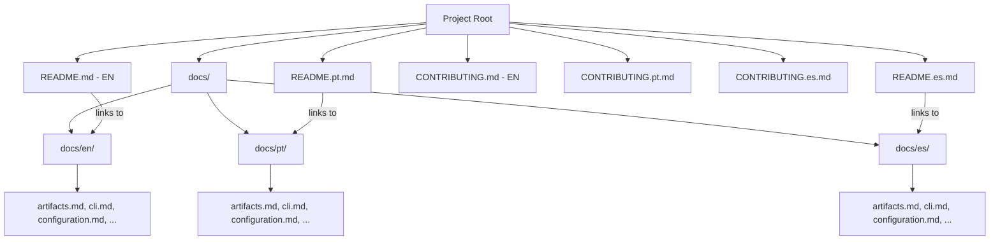

# Technical Design: Multi-language Documentation Expansion

## 1. Architecture Blueprint

## 2. File & Component Inventory

**Documentation Migration:**
- `README.md` -> [Add language selector at top, update relative links to `docs/en/`]
- `README.pt.md` -> [Translated version of README.md, links to `docs/pt/`]
- `README.es.md` -> [Translated version of README.md, links to `docs/es/`]
- `CONTRIBUTING.md` -> [Update relative links to `docs/en/`]
- `CONTRIBUTING.pt.md` -> [Translated version of CONTRIBUTING.md, links to `docs/pt/`]
- `CONTRIBUTING.es.md` -> [Translated version of CONTRIBUTING.md, links to `docs/es/`]

**Directory Restructuring:**
- `docs/en/` -> [Container for English docs]
- `docs/pt/` -> [Container for Portuguese docs]
- `docs/es/` -> [Container for Spanish docs]

**Existing Docs (Moving to `docs/en/` and duplicating/translating to `pt/` and `es/`):**
- `docs/artifacts.md` -> `docs/{en,pt,es}/artifacts.md`
- `docs/cli.md` -> `docs/{en,pt,es}/cli.md`
- `docs/configuration.md` -> `docs/{en,pt,es}/configuration.md`
- `docs/getting-started.md` -> `docs/{en,pt,es}/getting-started.md`
- `docs/git-worktrees.md` -> `docs/{en,pt,es}/git-worktrees.md`
- `docs/supported-tools.md` -> `docs/{en,pt,es}/supported-tools.md`

## 3. Link Update Logic
Every link within the `.md` files must be verified and adjusted:
- Links from `README.md` to `docs/*.md` must now point to `docs/en/*.md`.
- Links within `docs/en/*.md` to other files in the same directory remain the same but must be checked for correctness relative to the new `en/` nesting if they were using complex relative paths.
- Translated files in `docs/pt/` must have all their internal links point to other `docs/pt/` files.
