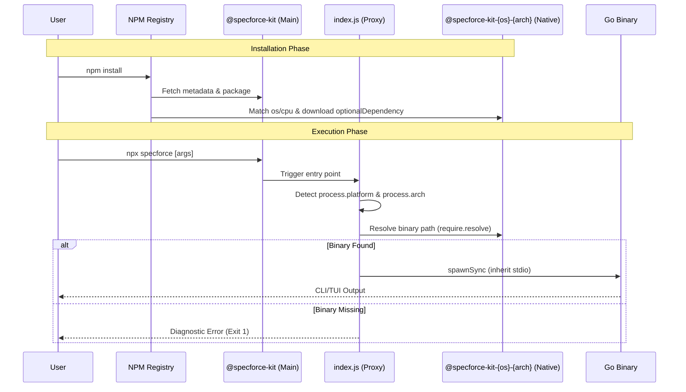

# Technical Design: Optional Native Packages

## 1. Architecture Blueprint
*A visual representation of the data flow and execution lifecycle for this feature.*

## 2. API & Interfaces (The Contract)
*(Render this section ONLY if new APIs or external contracts are created/modified. Otherwise, omit entirely).*
- **Endpoint:** `CLI Execution via index.js`
- **AuthZ / Roles:** Local user executing the CLI
- **Request Payload:** Command-line arguments (`process.argv`)
- **Response (200 OK):** Forwarded standard output (`stdout`) from Go Binary with exit code 0
- **Response (4xx/5xx):** Forwarded standard error (`stderr`) or diagnostic message with non-zero exit code

## 3. File & Component Inventory
*The exact files that the Developer must create or modify. Map the core responsibility.*

**Backend:**
- `.goreleaser.yaml` -> Configuration to generate package wrappers for each platform.
- `.github/workflows/release.yml` -> CI steps to package and publish sub-packages before the main package.
- `Makefile` -> Add targets for NPM package generation.

**Frontend:**
- `package.json` -> Remove `go-npm` and `postinstall`, add `optionalDependencies`.
- `index.js` -> The Node.js proxy script detecting `process.platform`/`process.arch` and spawning the executable.
