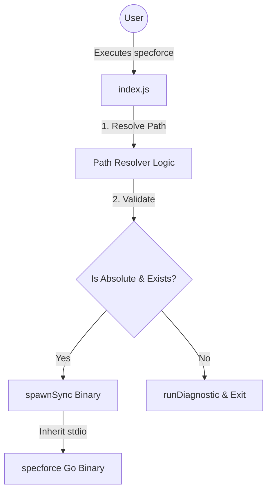

# Technical Design: Security Hardening (Socket.dev Alerts)

## 1. Architecture Blueprint

## 2. Persistence & Data Modeling
*No changes to persistence or data modeling.*

## 3. API & Interfaces (The Contract)
*No changes to external APIs. Internal proxy logic is updated.*

## 4. File & Component Inventory

**Backend:**
- `[package.json]` -> Remove `postinstall` and `prepare` scripts to eliminate supply chain risks.
- `[index.js]` -> Add explicit validation for `binaryPath` (must be absolute and exist) before `spawnSync`. Add security documentation comments.
- `[.specforce/docs/security.md]` -> Update to document the "Zero Scripts" policy and the approved use of `child_process` for the proxy.
- `[.specforce/docs/memorial.md]` -> Record the decision to remove install scripts in favor of explicit diagnostics.
