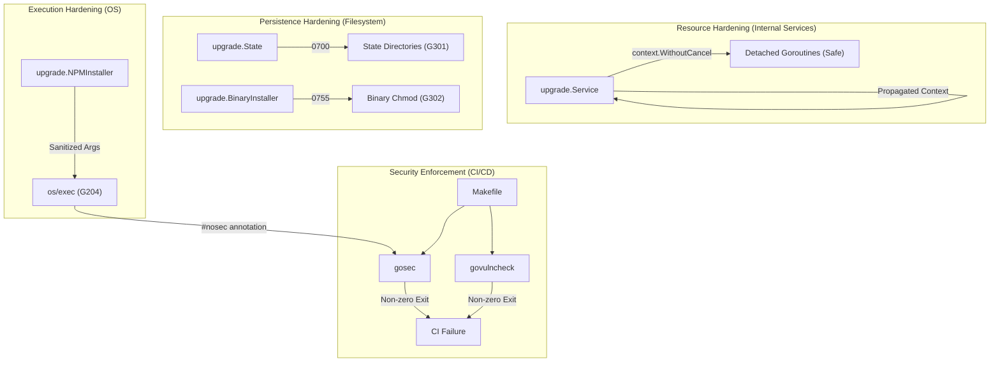

# Design: Security Hardening

## 1. Architecture Blueprint

The security hardening effort introduces explicit security gates and deterministic resource management across the upgrade and CI/CD domains.



## 2. Threat Modeling (Security-First)

| Threat | Mitigation | Mitigation Strategy |
| :--- | :--- | :--- |
| **Resource Leak / Premature Exit** | G118 Fix | Use `context.WithoutCancel(ctx)` in `upgrade.Service` to ensure background tasks survive parent context cancellation while still inheriting values (Correlation IDs, etc.). |
| **Shell Injection (G204)** | Input Sanitization | Enforce `os/exec` usage with explicit argument slices. Use `// #nosec G204` ONLY where arguments are audited and safe. |
| **Insecure Directory Permissions (G301)** | Restrictive Mask | Force `0700` permissions on internal state directories to ensure only the owner can read/write project metadata. |
| **Excessive File Permissions (G302)** | Least Privilege | Limit executable files to `0755` and explicitly annotate as `#nosec G302` for binary distribution requirements. |
| **Supply Chain Vulnerability** | Static Analysis | Integrate `govulncheck` into the primary security target to detect known CVEs in dependencies. |

## 3. Data & Persistence

### 3.1. Filesystem Permission Matrix

| Path/Target | Current Perms | Target Perms | Reason |
| :--- | :--- | :--- | :--- |
| `.specforce/upgrade/` (and subdirs) | `0755` | `0700` | Standard owner-only access for internal tool state. |
| `specforce` (binary) | `0755` | `0755` | Required for execution; audit via `#nosec`. |

## 4. API Contracts & Interfaces

### 4.1. Context Management Pattern
In `src/internal/upgrade/service.go`, the signature for background operations will change from using global background contexts to detached derived contexts.

```go
// Pattern change:
// FROM: go s.runTask(context.Background())
// TO:   go s.runTask(context.WithoutCancel(ctx))
```

## 5. File & Component Inventory

| File Path | Component | Hardening Type | Gosec ID |
| :--- | :--- | :--- | :--- |
| `src/internal/upgrade/service.go` | `upgrade.Service` | Goroutine context detachment | G118 |
| `src/internal/upgrade/installer_npm.go` | `NPMInstaller` | Subprocess command sanitization audit | G204 |
| `src/internal/upgrade/state.go` | `upgrade.State` | Directory creation permissions (`0700`) | G301 |
| `src/internal/upgrade/installer_binary.go` | `BinaryInstaller` | File chmod permissions (`0755`) | G302 |
| `Makefile` | Build System | Removal of suppression & `govulncheck` integration | N/A |

## 6. Observability & Resilience

### 6.1. Verification Mechanism
- **Static Analysis Gate:** The `make security` target becomes a blocking gate in CI.
- **Fail-Fast Shell:** Makefile targets are updated to ensure any failure in the pipe (e.g., `gosec` finding a bug) results in an immediate non-zero exit code for the entire task.
- **Log Correlation:** Detached contexts (`WithoutCancel`) MUST preserve the context's Value-store to ensure Structured Logging correlation IDs are maintained across the background boundary.
