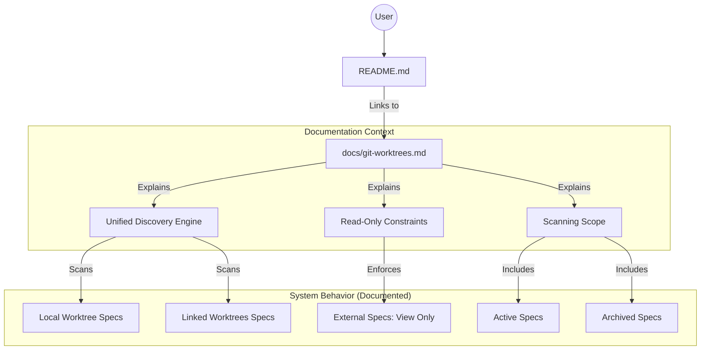

# Technical Design: Git Worktree Documentation

## 1. Architecture Blueprint
*This diagram illustrates the relationship between the Specforce TUI and the documentation structure explaining the cross-worktree discovery engine.*

## 4. File & Component Inventory
*The exact files that the Developer must create or modify. Map the core responsibility.*

**Documentation:**
- `docs/git-worktrees.md` -> Core documentation file providing a comprehensive guide on Specforce's Git Worktree support, including technical constraints and discovery logic.
- `README.md` -> Main entry point update to include references and links to the Git Worktree documentation, improving feature discoverability.

**Note:** Only write documentation. DO NOT write code.
