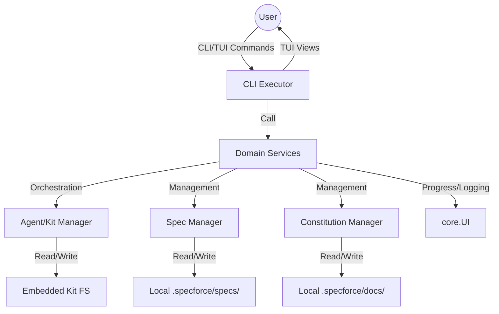

# Architecture

## Stack & Tooling Baseline
- **Backend:** Go (1.24.2+)
- **CLI Framework:** Cobra (for command routing, nested subcommands, and flag parsing)
- **Frontend:** TUI (Bubbletea, Bubbles, Lipgloss)
- **State Management:** Functional (Bubbletea Model/Update/View pattern)
- **Data:** Filesystem (Local `.specforce/` directory, JSON/Markdown/YAML)
- **Tooling/Infra:** Makefile (with dynamic `GOBIN` detection), Go CLI, Shell

## API & Communication Paradigm
- **Client-to-Server:** CLI/TUI (Internal function calls and direct FS access)
- **Internal-Services:** Modular Go packages in `src/internal/`

## Continuous Integration (CI)
- **Orchestration:** GitHub Actions.
- **Workflow Pattern:** Multi-job parallel pipeline to maximize feedback speed.
- **Security Integration:** Mandatory SARIF upload for security scanning results.

## High-Level Architecture (Mermaid)


## Architectural Principles
1. **Domain Logic Agnostic:** Core logic for managing specs and constitution MUST remain independent of the TUI/CLI framework.
2. **Service Layer Isolation:** All business logic orchestration MUST be encapsulated in domain-specific Services (e.g., `project.Service`, `spec.Service`). The CLI/TUI layer is restricted to gathering user input and displaying output, delegating all domain operations to these services.
3. **Embedded vs. Local:** Standard agent kits are embedded in the binary but MAY be overridden by local versions for development.
3. **File-Driven Truth:** The `.specforce/` directory is the single source of truth for the project's state.
4. Project Configuration: Global project-level instructions and settings are managed via `.specforce/config.yaml` and loaded into the `core.ProjectConfig` entity.
5. Automatic Configuration Initialization: To improve discoverability and ease of use, the `specforce init` command MUST automatically generate a default `.specforce/config.yaml` file populated with illustrative examples if it does not already exist.
6. Strict Typing: All data models (Spec, Constitution, Artifacts) must have rigorous Go struct definitions and schema validation.

6. **Metadata-Driven Discovery:** Systems that manage sets of dynamic components (e.g., Agents, Skills) MUST use metadata files (e.g., `manifest.yaml`) for discovery within an `fs.FS`. Hardcoded lists are forbidden to ensure extensibility without recompilation.
7. **Graceful Lifecycle Management:** The application's lifecycle MUST be controlled by a root `context.Context` initialized at the entry point (`main.go`). This context must respond to OS interrupt signals (SIGINT, SIGTERM) to ensure all I/O-heavy operations can be cancelled cleanly by the user.

8. **Parallel Execution & Aggregation:** Systems that execute multiple independent external commands (e.g., Hooks, Lints, Tests) MUST do so in parallel using `sync.WaitGroup` and goroutines. The results (Stdout, Stderr, ExitCode) MUST be aggregated into a standard `core.HookResult` struct and returned together after all operations complete. If any command fails, a specialized error (e.g., `core.HookError`) containing all results MUST be returned to the caller.

10. **Complexity Reduction Pattern:** Systems with high cognitive complexity or long methods MUST be refactored using private helper extraction or sub-component isolation to ensure maintainability and testability.

## Repository Topology
- **Topology:** Single-repo (CLI Monolith)
- **Rationale:** Simplifies distribution as a single binary and reduces dependency management overhead.

## Directory Structure
```
specforce/
├── .specforce/
│   ├── docs/          # Constitution artifacts
│   ├── specs/         # Feature specifications
│   ├── templates/     # Specification templates
│   └── archive/       # Archived specs
├── src/
│   ├── cmd/           # CLI entry points
│   └── internal/      # Core project logic
│       ├── agent/     # Kit/Agent management
│       ├── cli/       # CLI command routing
│       ├── core/      # Shared interfaces (UI)
│       ├── project/   # Project lifecycle (Init/Bootstrap)
│       └── tui/       # TUI components and views
└── Makefile
```

## Directory & Naming Standards
- **Feature specs:** `.specforce/specs/{slug}/`
- **Constitution docs:** `.specforce/docs/`
- **AI Agent Hidden Directories:** Native hidden names MUST be used (e.g., `.claude/`, `.opencode/`, `.kilocode/`, `.agent/`). Root-level agent files (e.g., `CLAUDE.md`) are forbidden.
- **AI Agent Command Naming:** For specialized agents (OpenCode, KiloCode, Kimi Code), commands MUST be adapted for native discovery:
  - **OpenCode/KiloCode:** Use a flat structure (`commands/`) and follow the `spf.{command}.md` naming convention (e.g., `spf.archive.md`).
  - **Kimi Code:** Use a nested subdirectory structure (`skills/spf-{command}/SKILL.md`) to satisfy the "Skills-First" architecture requirements.
- **Source layout:** CamelCase for Go packages and filenames within `src/internal/`.

## Domain & Identity Standards
1. **Slug Uniqueness (Identity):** All specification slugs MUST be globally unique within the project's entire lifecycle (including active and archived states).
2. **Kebab-Case Enforcement:** All slugs MUST be formatted in `kebab-case` to ensure cross-platform compatibility and URL safety.
3. **Identity Check (Safety):** The system MUST verify slug uniqueness against both `.specforce/specs/` and `.specforce/archive/` before initializing any new feature.

## Error Handling Strategy
- **Domain Error Registry:** `src/internal/core/errors.go` is the single source of truth for all cross-domain sentinel errors (`ErrProjectAlreadyInitialized`, `ErrAgentNotFound`, `ErrInvalidSpecFile`, `ErrInstallerPermissionDenied`). New domains MUST register their errors here.
- **Layered Error Propagation:** Errors flow upward through layers  -  I/O → Service → CLI  -  each layer adding context via `%w` wrapping. The CLI layer is the only layer responsible for translating domain errors into user-facing messages.
- **`errors.Is` as the Contract:** All cross-layer error checks MUST use `errors.Is` (never string matching). This ensures the chain remains navigable regardless of wrapping depth.

## Observability Baseline
- **Structured Logs:** Minimal logging via CLI output; TUI-driven state reporting.
- **Error Traceability:** Critical errors must be clearly displayed in the TUI or terminal stderr with context.
- **Spec Correlation:** Implementation tasks should reference their respective Spec IDs.
